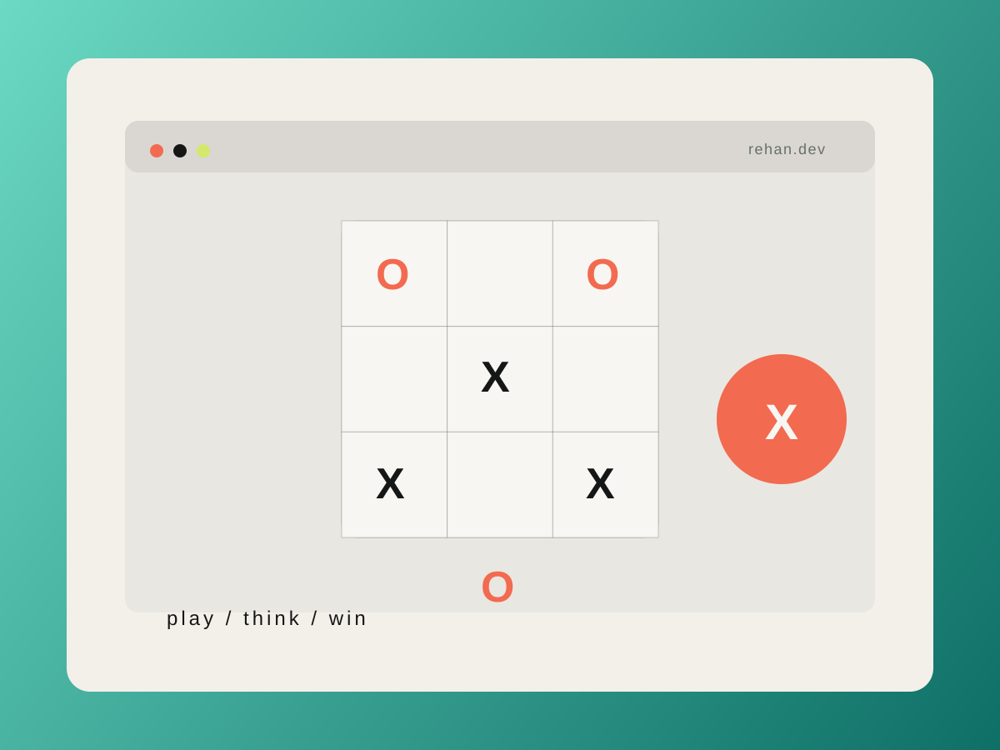

# Mohd Rehan Khan | Portfolio Website

A personal portfolio website showcasing my work as a web developer and aspiring mobile app developer. It highlights selected projects, technical interests, and contact details in a modern one-page layout.

## Live Portfolio

[Open Portfolio](https://mohd-rehan-khan.github.io/)

## About

This portfolio is built using HTML, CSS, and JavaScript and focuses on:

- Clean, responsive design
- Strong project storytelling
- Clear developer branding
- Easy contact and portfolio discovery

## Tech Stack

- HTML5
- CSS3
- JavaScript
- Responsive web design

## Project Screenshots

### 1. Tic Tac Toe Game



A simple but polished browser game built with HTML, CSS, and JavaScript. It focuses on interaction design, game logic, and a clean game board.

### 2. AI Research Agent


A Python-based research assistant designed to collect information, organize findings, and present a structured answer to a user query.

### 3. Multi-Agent Workflow


An exploration into multi-agent automation and task coordination using Python. The project reflects my interest in AI workflows and intelligent systems.

## Featured Projects

- Tic Tac Toe Game
  - Web game built with HTML, CSS, and JavaScript
  - Live demo available

- AI Research Agent
  - Python AI workflow for research synthesis
  - GitHub project showcasing intelligent automation

- Multi-Agent Workflow
  - Python automation system exploring collaborative agent behavior

## Run Locally

1. Clone the repository
2. Open `index.html` in a browser, or run a local static server
3. Optional local server command:

```bash
python -m http.server 8000
```

Then visit:

```text
http://localhost:8000
```

## Contact

- Email: mohdrehankhan296@gmail.com
- GitHub: [mohd-rehan-khan](https://github.com/mohd-rehan-khan)

## License

This project is for personal portfolio use.
